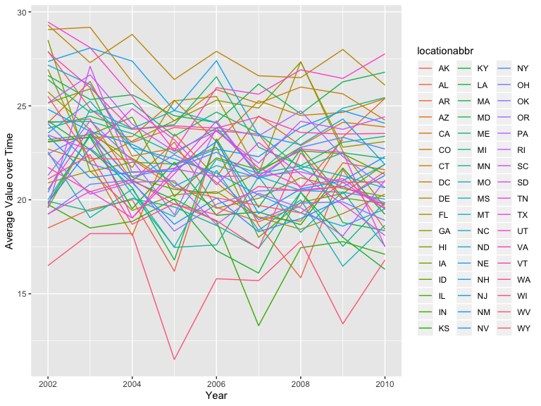

p8105\_hw3\_stl2137.Rmd
================

# Homework 3

## Problem 1

The instacart dataset is comprised of 1384617 observations and 15
variables. Key variables (in the context of this analysis) include
`product_name`, which is the name of the product (for example: 96% Lean
Ground Beef, 24 Carrot Gold Paleo Muffins, 2nd Foods Bananas); `aisle`,
which is the name of the aisle a product comes from (for example: meat
counter, breakfast bakery, baby food formula); `order_dow`, which is the
day of the week on which the order was placed; and `order_hour_of_day`,
which is the hour of the day on which the order was placed.

``` r
aisle_count <- instacart %>% 
  count(aisle) %>% 
  arrange(desc(n))
```

There are a total of 134 aisles, and the top 6 aisles where the most
items are ordered from are fresh vegetables, fresh fruits, packaged
vegetables fruits, yogurt, packcaged cheese, and water seltzer sparkling
water.

### Plot that shows Number of Items Ordered per Aisle

``` r
instacart %>% 
  select(aisle, department) %>% 
  count(aisle) %>% 
  arrange(desc(n)) %>% 
  filter(n > 10000) %>% 
  ggplot(aes(x = aisle, y = n)) +
  geom_col() +
  labs(
    x = "Name of Aisle",
    y = "Number of Items Ordered",
    title = "Number of Items Ordered per Aisle"
  ) + 
  theme(axis.text.x = element_text(angle = 90, hjust = 1))
```


\* Fresh fruits and fresh vegetables are ordered much more frequently
than the rest of the products customers can order via Instacart.
Packaged vegetables fruit are the 3rd most ordered product, and yogurt
is the 4th most ordered
product.

### Table showing the three most popular items in the aisles “baking ingredients”, “dog food care”, and “packaged vegetables fruits”

``` r
instacart %>% 
  filter(aisle %in% c("baking ingredients", "dog food care", "packaged vegetables fruits")) %>% 
  group_by(aisle) %>% 
  count(product_name) %>% 
  arrange(desc(n)) %>% 
  top_n(n = 3)
```

    ## Selecting by n

    ## # A tibble: 9 x 3
    ## # Groups:   aisle [3]
    ##   aisle                     product_name                                  n
    ##   <chr>                     <chr>                                     <int>
    ## 1 packaged vegetables frui… Organic Baby Spinach                       9784
    ## 2 packaged vegetables frui… Organic Raspberries                        5546
    ## 3 packaged vegetables frui… Organic Blueberries                        4966
    ## 4 baking ingredients        Light Brown Sugar                           499
    ## 5 baking ingredients        Pure Baking Soda                            387
    ## 6 baking ingredients        Cane Sugar                                  336
    ## 7 dog food care             Snack Sticks Chicken & Rice Recipe Dog T…    30
    ## 8 dog food care             Organix Chicken & Brown Rice Recipe          28
    ## 9 dog food care             Small Dog Biscuits                           26

  - The top three items in the “packaged vegetables fruits” aisle are
    Organize Baby Spinach (ordered 9784 times), Organic Raspberries
    (ordered 5546 times), and Organic Blueberries (ordered 4966 times).

  - The top three items in the “baking ingredients” aisle are Light
    Brown Sugar (ordered 499 times), Pure Baking Soda (ordered 387
    times), and Cane Sugar (ordered 336 times).

  - The top three items in the “dog food care” aisle are Snack Sticks
    Chicken & Rice Recipe Dog Treats (ordered 30 times), Organix Chicken
    & Brown Rice Recipe (ordered 28 times), and Small Dog Biscuits
    (ordered 26
times).

### Table showing the mean hour of the day at which Pink Lady Apples and Coffee Ice Cream are ordered on each day of the week

``` r
instacart %>%
  filter(product_name %in% c("Pink Lady Apples", "Coffee Ice Cream")) %>% 
  group_by(order_dow, product_name) %>%
  summarise(
    mean_time = mean(order_hour_of_day) 
  ) %>% 
  pivot_wider(
    names_from = order_dow,
    values_from = mean_time
  ) 
```

    ## # A tibble: 2 x 8
    ##   product_name       `0`   `1`   `2`   `3`   `4`   `5`   `6`
    ##   <chr>            <dbl> <dbl> <dbl> <dbl> <dbl> <dbl> <dbl>
    ## 1 Coffee Ice Cream  13.8  14.3  15.4  15.3  15.2  12.3  13.8
    ## 2 Pink Lady Apples  13.4  11.4  11.7  14.2  11.6  12.8  11.9

  - Overall, Coffee Ice Cream is ordered later in the day compared to
    Pink Lady Apples.

  - On Sunday, the mean hour of the day to order both Coffee Ice Cream
    and Pink Lady Apples is in the 1 PM hour.

  - On Monday, the mean hour of the day to order Coffee Ice cream is in
    the 2 PM hour, and the mean hour of the day to order Pink Lady
    Apples is in the 11 AM hour.

  - On Tuesday, the mean hour of the day to order Coffee Ice cream is in
    the 3 PM hour, and the mean hour of the day to order Pink Lady
    Apples is in the 11 AM hour.

  - On Wednesday, the mean hour of the day to order Coffee Ice cream is
    in the 3 PM hour, and the mean hour of the day to order Pink Lady
    Apples is in the 2 PM hour.

  - On Thursday, the mean hour of the day to order Coffee Ice cream is
    in the 3 PM hour, and the mean hour of the day to order Pink Lady
    Apples is in the 11 AM hour.

  - On Friday, the mean hour of the day to order both Coffee Ice Cream
    and Pink Lady Apples is in the 12 PM hour.

  - On Saturday, the mean hour of the day to order Coffee Ice cream is
    in the 2 PM hour, and the mean hour of the day to order Pink Lady
    Apples is in the 11 AM hour.

## Problem 2

### Data Cleaning\!

``` r
brfss_clean <- brfss_smart2010 %>% 
  janitor::clean_names() %>% 
  filter(topic %in% "Overall Health") %>% 
  mutate(
    response = ordered(response, c("Excellent", "Very good", "Good", "Fair", "Poor"))
  ) 
```

Using this dataset, do or answer the following (commenting on the
results of
each):

### In 2002, which states were observed at 7 or more locations? What about in 2010?

``` r
brfss_2002 <- brfss_clean %>% 
  filter(year %in% 2002) %>% 
  group_by(locationabbr) %>% 
  summarise(
    count = length(unique(locationdesc))
  ) %>% 
  filter(
    count >= 7
  )

brfss_2010 <- brfss_clean %>% 
  filter(year %in% 2010) %>% 
  group_by(locationabbr) %>% 
  summarise(
    count = length(unique(locationdesc))
  ) %>% 
  filter(
    count >= 7
  )
```

  - In 2002, the following 6 states were observed at 7 or more
    locations: Connecticut (CT), Florida (FL), Massachusetts (MA), North
    Carolina (NC), New Jersey (NJ), and Pennsylvania (PA).

  - In 2010, the following 14 states were observed at 7 or more
    locations: California (CA), Colorado (CO), Florida (FL),
    Massachusetts (MA), Maryland (MD), North Carolina (NC), Nebraska
    (NE), New Jersey (NJ), New York (NY), Ohio (OH), Pennsylvania (PA),
    South Carolina (SC), Texas (TX), and Washington (WA).

### Spaghetti Plot

``` r
brfss_excellent <- brfss_clean %>%
  filter(response %in% "Excellent") %>% 
  group_by(year, locationabbr) %>%
  summarise(
    mean_data_value =  mean(data_value, na.rm = TRUE)
  ) %>% 
  select(year, locationabbr, mean_data_value)
  
ggplot(brfss_excellent, aes(x = year, y = mean_data_value, group = locationabbr, color = locationabbr)) +
  geom_line() +
  labs(
    x = "Year",
    y = "Average Value over Time"
  )
```


\* This spaghetti plot is difficult to read, as there are 50 lines for
each of the 50
states.

### Two-panel Plot showing, for the years 2006, and 2010, distribution of data\_value for responses (“Poor” to “Excellent”) among locations in NY State

``` r
brfss_ny <- brfss_clean %>% 
  filter(year %in% c(2006, 2010), 
         locationabbr %in% "NY",
        )   

ggplot(brfss_ny, aes(x = response, y = data_value, group = interaction(response, locationdesc), fill = locationdesc)) +
  geom_col(position = "dodge") + 
  theme(legend.position = "bottom", axis.text.x = element_text(angle = 90, hjust = 1)) +
  labs(
    x = "Location by County",
    y = "Data Value",
    title = "Distribution of Data Value from Poor to Excellent"
  ) +
  facet_grid(.~year) +
  scale_fill_viridis(discrete = TRUE) 
```


\* More locations were added in additional New York counties in 2010.
There also appear to have more “very good” reviews in 2010 compared to
2006 across all New York Counties.

## Problem 3

``` r
accel_data <- read_csv("./hw3_data/accel_data.csv")
```

    ## Parsed with column specification:
    ## cols(
    ##   .default = col_double(),
    ##   day = col_character()
    ## )

    ## See spec(...) for full column specifications.

There are 35 observations and 1443 variables. Each row observation
represents a new day. The variables in the dataset include `week`,
`day_id` (each day has a unique day\_id), `day` (representing day of the
week), and `activity.1:activity.1440` (representing each minute of the
day).

``` r
accel_data_clean <- accel_data %>% 
  janitor::clean_names() %>% 
  mutate(
    weekend = ifelse(day %in% c("Saturday", "Sunday"), 1, 0),
    day = as.factor(day)
  ) %>% 
  group_by(day_id) %>% 
  pivot_longer(
    cols = -c(week, day, day_id),
    names_to = "activity_minute",
    values_to = "activity_value"
  ) %>%
  mutate(
    minute = seq(n()),
    hour = minute/60
  )
```

### Create Table Showing Day Activity Total

``` r
total_activity_table <- accel_data_clean %>% 
  group_by(day_id) %>% 
  summarise(
    total_activity = sum(activity_value),
    day = unique(day)
  )
```

  - Looking at the table alone, there are no apparent
trends.

### Single-panel plot that shows the 24-hour activity time courses for each day Describe in words any patterns or conclusions you can make based on this graph.

``` r
ggplot(accel_data_clean, aes(x = hour, y = activity_value, group = day_id, color = day)) +
  geom_line() +
  theme(legend.position = "bottom")
```


\* The patient appears to be more active from the 8 PM to midnight hours
during the duration of the study. The patient is consistenly inactive
from midnight to 5 AM. Between the hours of 5 AM to 5 PM, there are
multiple spikes; on Sunday the patient appears to be most active from 10
AM to noon, and on Saturday, the patients appears to be more active from
4 PM to 5 PM.
