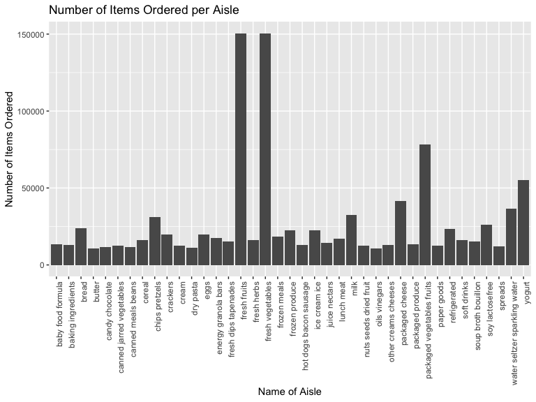

p8105\_hw3\_stl2137.Rmd
================

# Homework 3

## Problem 1

The instacart dataset is comprised of 1384617 observations and 15
variables. Key variables (in the context of this analysis) include
`product_name`, which is the name of the product (for example: 96% Lean
Ground Beef, 24 Carrot Gold Paleo Muffins, 2nd Foods Bananas); `aisle`,
which is the name of the aisle a product comes from (for example: meat
counter, breakfast bakery, baby food formula); `order_dow`, which is the
day of the week on which the order was placed; and `order_hour_of_day`,
which is the hour of the day on which the order was placed.

``` r
aisle_count <- instacart %>% 
  count(aisle) %>% 
  arrange(desc(n))
```

There are a total of `count(aisle_count)` aisles, and the top 6 aisles
where the most items are ordered from are fresh vegetables, fresh
fruits, packaged vegetables fruits, yogurt, packcaged cheese, and water
seltzer sparkling water.

Make a plot that shows the number of items ordered in each aisle,
limiting this to aisles with more than 10000 items ordered. Arrange
aisles sensibly, and organize your plot so others can read it.

``` r
instacart %>% 
  select(aisle, department) %>% 
  count(aisle) %>% 
  arrange(desc(n)) %>% 
  filter(n > 10000) %>% 
  ggplot(aes(x = aisle, y = n)) +
  geom_col() +
  labs(
    x = "Name of Aisle",
    y = "Number of Items Ordered"
  ) + 
  theme(axis.text.x = element_text(angle = 90, hjust = 1))
```

<!-- -->

Make a table showing the three most popular items in each of the aisles
“baking ingredients”, “dog food care”, and “packaged vegetables
fruits”. Include the number of times each item is ordered in your
table.

``` r
instacart %>% 
  filter(aisle %in% c("baking ingredients", "dog food care", "packaged vegetables fruits")) %>% 
  group_by(aisle) %>% 
  count(product_name) %>% 
  arrange(desc(n)) %>% 
  top_n(n = 3)
```

    ## Selecting by n

    ## # A tibble: 9 x 3
    ## # Groups:   aisle [3]
    ##   aisle                     product_name                                  n
    ##   <chr>                     <chr>                                     <int>
    ## 1 packaged vegetables frui… Organic Baby Spinach                       9784
    ## 2 packaged vegetables frui… Organic Raspberries                        5546
    ## 3 packaged vegetables frui… Organic Blueberries                        4966
    ## 4 baking ingredients        Light Brown Sugar                           499
    ## 5 baking ingredients        Pure Baking Soda                            387
    ## 6 baking ingredients        Cane Sugar                                  336
    ## 7 dog food care             Snack Sticks Chicken & Rice Recipe Dog T…    30
    ## 8 dog food care             Organix Chicken & Brown Rice Recipe          28
    ## 9 dog food care             Small Dog Biscuits                           26

Make a table showing the mean hour of the day at which Pink Lady Apples
and Coffee Ice Cream are ordered on each day of the week; format this
table for human readers (i.e. produce a 2 x 7 table).

``` r
instacart %>%
  filter(product_name %in% c("Pink Lady Apples", "Coffee Ice Cream")) %>% 
  group_by(order_dow, product_name) %>%
  summarise(
    mean_time = mean(order_hour_of_day) 
  ) %>% 
  pivot_wider(
    names_from = order_dow,
    values_from = mean_time
  ) 
```

    ## # A tibble: 2 x 8
    ##   product_name       `0`   `1`   `2`   `3`   `4`   `5`   `6`
    ##   <chr>            <dbl> <dbl> <dbl> <dbl> <dbl> <dbl> <dbl>
    ## 1 Coffee Ice Cream  13.8  14.3  15.4  15.3  15.2  12.3  13.8
    ## 2 Pink Lady Apples  13.4  11.4  11.7  14.2  11.6  12.8  11.9

## Problem 2

``` r
brfss_clean <- brfss_smart2010 %>% 
  janitor::clean_names() %>% 
  filter(topic %in% "Overall Health") %>% 
  mutate(
    response = ordered(response, c("Excellent", "Very good", "Good", "Fair", "Poor"))
  ) 
```

Using this dataset, do or answer the following (commenting on the
results of each):

In 2002, which states were observed at 7 or more locations? What about
in 2010?

``` r
brfss_clean %>% 
  filter(year %in% 2002) %>% 
  group_by(locationabbr) %>% 
  summarise(
    count = length(unique(locationdesc))
  ) %>% 
  filter(
    count >= 7
  )
```

    ## # A tibble: 6 x 2
    ##   locationabbr count
    ##   <chr>        <int>
    ## 1 CT               7
    ## 2 FL               7
    ## 3 MA               8
    ## 4 NC               7
    ## 5 NJ               8
    ## 6 PA              10

``` r
brfss_clean %>% 
  filter(year %in% 2010) %>% 
  group_by(locationabbr) %>% 
  summarise(
    count = length(unique(locationdesc))
  ) %>% 
  filter(
    count >= 7
  )
```

    ## # A tibble: 14 x 2
    ##    locationabbr count
    ##    <chr>        <int>
    ##  1 CA              12
    ##  2 CO               7
    ##  3 FL              41
    ##  4 MA               9
    ##  5 MD              12
    ##  6 NC              12
    ##  7 NE              10
    ##  8 NJ              19
    ##  9 NY               9
    ## 10 OH               8
    ## 11 PA               7
    ## 12 SC               7
    ## 13 TX              16
    ## 14 WA              10

Construct a dataset that is limited to Excellent responses, and
contains, year, state, and a variable that averages the data\_value
across locations within a state. Make a “spaghetti” plot of this average
value over time within a state (that is, make a plot showing a line for
each state across years – the geom\_line geometry and group aesthetic
will help).

``` r
brfss_excellent <- brfss_clean %>%
  filter(response %in% "Excellent") %>% 
  group_by(year, locationabbr) %>%
  summarise(
    mean_data_value =  mean(data_value, na.rm = TRUE)
  ) %>% 
  select(year, locationabbr, mean_data_value)
  
ggplot(brfss_excellent, aes(x = year, y = mean_data_value, group = locationabbr, color = locationabbr)) +
  geom_line() 
```

<!-- -->

Make a two-panel plot showing, for the years 2006, and 2010,
distribution of data\_value for responses (“Poor” to “Excellent”) among
locations in NY State

``` r
brfss_ny <- brfss_clean %>% 
  filter(year %in% c(2006, 2010), 
         locationabbr %in% "NY",
        )   

ggplot(brfss_ny, aes(x = response, y = data_value, group = interaction(response, locationdesc), fill = locationdesc)) +
  geom_col(position = "dodge") + 
  theme(legend.position = "bottom") +
  facet_grid(.~year) +
  scale_fill_viridis(discrete = TRUE)
```

<!-- -->

## Problem 3

``` r
accel_data <- read_csv("./hw3_data/accel_data.csv")
```

    ## Parsed with column specification:
    ## cols(
    ##   .default = col_double(),
    ##   day = col_character()
    ## )

    ## See spec(...) for full column specifications.

``` r
accel_data_clean <- accel_data %>% 
  janitor::clean_names() %>% 
  mutate(
    weekend = ifelse(day %in% c("Saturday", "Sunday"), 1, 0),
    day = as.factor(day)
  ) %>% 
  group_by(day_id) %>% 
  pivot_longer(
    cols = -c(week, day, day_id),
    names_to = "activity_minute",
    values_to = "activity_value"
  ) %>%
  mutate(
    minute = seq(n()),
    hour = minute/60
  )
```

Using your tidied dataset, aggregate accross minutes to create a total
activity variable for each day, and create a table showing these totals.
Are any trends apparent?

``` r
total_activity_table <- accel_data_clean %>% 
  group_by(day_id) %>% 
  summarise(
    total_activity = sum(activity_value),
    day = unique(day)
  )
```

Make a single-panel plot that shows the 24-hour activity time courses
for each day and use color to indicate day of the week. Describe in
words any patterns or conclusions you can make based on this
graph.

``` r
ggplot(accel_data_clean, aes(x = hour, y = activity_value, group = day_id, color = day)) +
  geom_line() +
  theme(legend.position = "bottom")
```

<!-- -->
